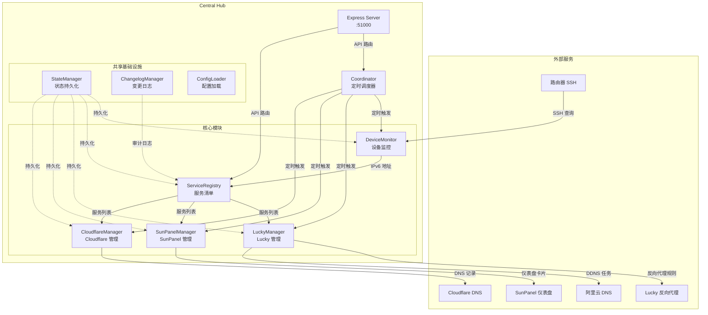
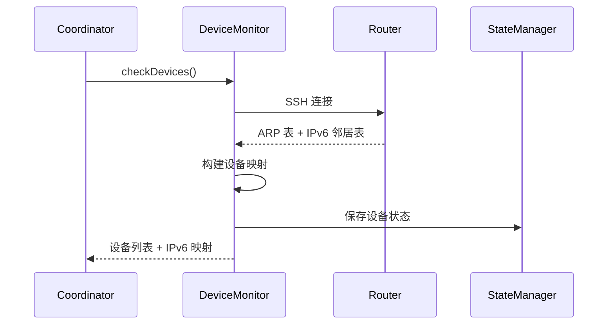
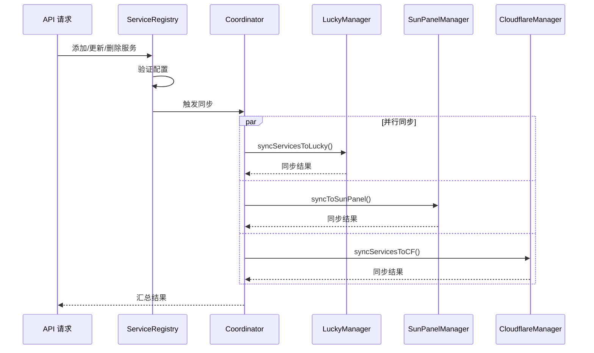
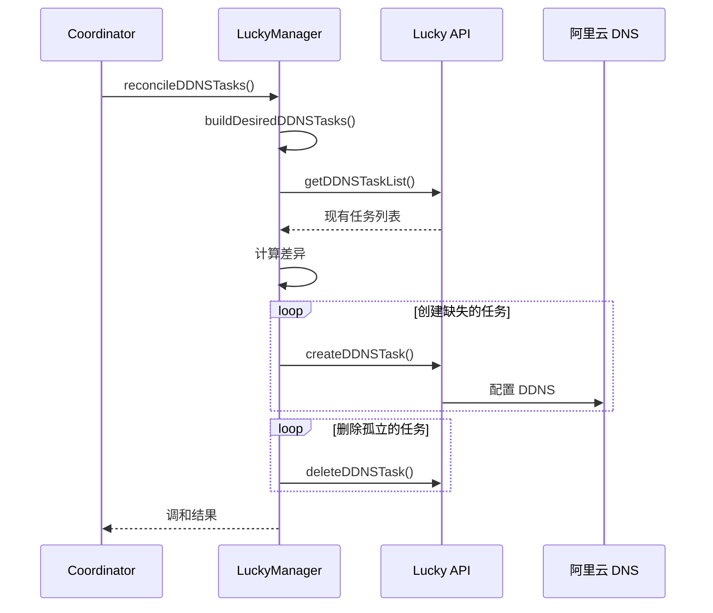
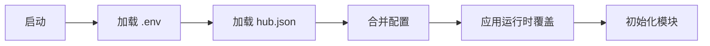

# 架构文档

## 系统架构



## 数据流

### 1. 设备发现流程



### 2. 服务同步流程



### 3. DDNS 调和流程



## 模块职责

### DeviceMonitor（设备监控）
**职责**：
- 通过 SSH 连接路由器
- 获取 ARP 表和 IPv6 邻居表
- 构建设备 ID 到 IPv6 地址的映射
- 维护设备状态

**依赖**：
- `ssh2` - SSH 客户端
- `StateManager` - 状态持久化

**输出**：
- `ipv6Map`: `{ deviceId: ipv6Address }`
- `devices`: 设备详细信息

### ServiceRegistry（服务清单）
**职责**：
- 管理服务清单（CRUD）
- 验证服务配置
- 提供服务查询接口
- 记录变更日志

**依赖**：
- `StateManager` - 状态持久化
- `ChangelogManager` - 变更审计

**数据结构**：
```javascript
{
  id: 'service-id',
  name: '服务名称',
  device: '200',
  internalPort: 8080,
  internalProtocol: 'http',
  enableProxy: true,
  proxyDomain: 'service.example.com',
  proxyType: 'http',
  enableTLS: true,
  group: '分组名称',
  description: '服务描述'
}
```

### LuckyManager（Lucky 管理）
**职责**：
- 管理 Lucky 反向代理规则
- 管理 Lucky 内置 DDNS 任务
- 管理 SSL 证书
- 支持多实例部署

**依赖**：
- `axios` - HTTP 客户端
- `StateManager` - 状态持久化

**API 封装**：
- `lucky-api.mjs` - 基础 API 调用
- `lucky-port-manager.mjs` - 端口管理
- `lucky-reverseproxy.mjs` - 反向代理规则
- `lucky-ddns.mjs` - DDNS 任务管理
- `lucky-ssl.mjs` - SSL 证书管理

### SunPanelManager（SunPanel 管理）
**职责**：
- 同步服务到 SunPanel 仪表盘
- 自动创建分组
- 管理卡片图标
- 支持多实例部署

**依赖**：
- `axios` - HTTP 客户端
- `StateManager` - 状态持久化

**特性**：
- 图标回退机制（多个图标源）
- Hash 比对避免重复更新
- 自动清理孤立卡片

### CloudflareManager（Cloudflare 管理）
**职责**：
- 同步服务到 Cloudflare DNS
- 管理 A/AAAA 记录
- 自动获取公网 IPv4
- 支持 Proxied 模式

**依赖**：
- `axios` - HTTP 客户端
- `StateManager` - 状态持久化

**特性**：
- 多 IPv4 提供商回退
- IPv6 优先策略
- 自动清理孤立记录

### Coordinator（协调器）
**职责**：
- 定时调度所有模块
- 编排同步流程
- 汇总执行结果
- 错误处理和重试

**调度任务**：
- `deviceMonitor`: 每 10 分钟
- `ddns`: 每 10 分钟
- `luckySync`: 每 15 分钟
- `sunpanelSync`: 每 15 分钟
- `cloudflareSync`: 每 15 分钟
- `saveState`: 每 1 分钟

## 配置系统

### 配置优先级
```
环境变量 (.env) > JSON 配置 (hub.json) > 默认值
```

### 配置加载流程


### 配置文件位置
- `.env` - 环境变量（优先级最高）
- `config/hub.json` - 主配置文件
- `central-hub/config/hub.json` - 备用配置（待废弃）

## 状态管理

### StateManager
**存储位置**：`data/hub-state.json`

**数据结构**：
```javascript
{
  devices: {
    lastUpdate: '2024-04-30T00:00:00.000Z',
    devices: { ... },
    ipv6Map: { ... }
  },
  services: {
    services: [ ... ],
    proxyDefaults: { ... }
  },
  lucky: {
    lastSync: '2024-04-30T00:00:00.000Z',
    syncStatus: { ... },
    ddnsTasks: [ ... ],
    ddnsLastReconcile: '2024-04-30T00:00:00.000Z'
  },
  sunpanel: {
    lastSync: '2024-04-30T00:00:00.000Z',
    syncStatus: { ... }
  },
  cloudflare: {
    lastSync: '2024-04-30T00:00:00.000Z',
    syncStatus: { ... }
  }
}
```

### 备份策略
- 自动备份到 `data/backups/`
- 保留最近 10 个历史版本
- 每次保存前创建备份

## API 路由

### 核心路由
- `/api/health` - 健康检查
- `/api/dashboard/*` - 仪表盘数据
- `/api/devices/*` - 设备管理
- `/api/services/*` - 服务清单
- `/api/ddns/*` - DDNS 管理
- `/api/proxies/*` - Lucky 代理
- `/api/cloudflare/*` - Cloudflare DNS
- `/api/sync/*` - 同步控制
- `/api/config/*` - 配置查看

### 认证机制
**当前状态**：无认证（仅内网访问）  
**计划**：添加 API Token 认证

## 部署架构

### 生产环境
```
┌─────────────────────────────────────┐
│         Nginx / Caddy               │
│    (反向代理 + Basic Auth)          │
└──────────────┬──────────────────────┘
               │
┌──────────────▼──────────────────────┐
│      Central Hub (:51000)           │
│      (PM2 管理)                     │
└──────────────┬──────────────────────┘
               │
    ┌──────────┼──────────┐
    │          │          │
┌───▼───┐  ┌──▼───┐  ┌──▼────┐
│ Lucky │  │ Sun  │  │ Cloud │
│       │  │Panel │  │flare  │
└───────┘  └──────┘  └───────┘
```

### 开发环境
```bash
npm run dev  # 带 --watch 自动重载
```

## 性能考虑

### 并发控制
- 同步任务按依赖关系串行/并行执行
- 外部 API 调用有超时控制
- 支持多实例并行同步

### 缓存策略
**当前**：无缓存  
**计划**：添加短期缓存（5 分钟）

### 资源限制
- PM2 内存限制：500MB
- API 超时：10 秒
- SSH 超时：10 秒

## 错误处理

### 错误传播
```
模块内部错误 → 捕获并记录 → 返回结构化错误 → 上层处理
```

### 重试策略
- 网络错误：自动重试 3 次
- 认证错误：不重试，立即失败
- 配置错误：不重试，记录日志

## 监控和日志

### 日志级别
- `debug` - 详细调试信息
- `info` - 一般信息（默认）
- `warn` - 警告信息
- `error` - 错误信息

### 日志输出
- 控制台：彩色输出
- 文件：`logs/hub.log`（计划）

### 监控指标（计划）
- 同步成功率
- API 响应时间
- 错误率
- 系统资源使用

## 安全考虑

### 当前措施
- 敏感信息通过环境变量管理
- 日志中脱敏处理
- 仅内网访问

### 计划改进
- API Token 认证
- CORS 配置收紧
- 请求频率限制
- 审计日志增强

## 扩展性

### 添加新模块
1. 在 `modules/` 下创建模块目录
2. 实现标准接口（`init()`, `getStatus()`）
3. 在 `server.mjs` 中注册
4. 在 `coordinator.mjs` 中添加调度

### 添加新 API
1. 在 `central-hub/routes/` 下创建路由文件
2. 在 `server.mjs` 中挂载路由
3. 添加对应的测试

## 测试策略

### 测试覆盖
- 单元测试：模块核心逻辑
- 集成测试：模块间交互
- API 测试：路由端点

### 测试工具
- Node.js 内置 `node:test`
- Mock 外部 API 调用
- 测试并发度：1（避免状态冲突）

## 参考资料

- [Express 官方文档](https://expressjs.com/)
- [Node.js 最佳实践](https://github.com/goldbergyoni/nodebestpractices)
- [Lucky 文档](https://lucky666.cn/)
- [SunPanel 文档](https://doc.sunpanel.top/)
- [Cloudflare API 文档](https://developers.cloudflare.com/api/)
